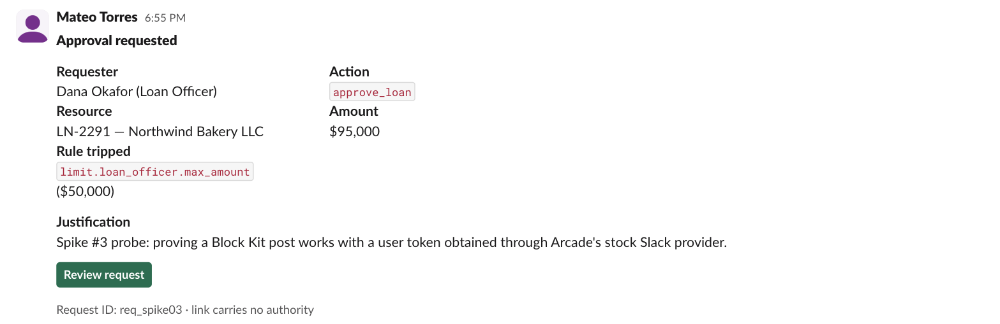

# Spike 03 — experiment transcript

Run 2026-09-02 against the throwaway project from spike 02 (Arcade prod org), Slack workspace
`ArcadeDevTest`, authorizing user `mateo@arcade.dev`. Tokens and the Slack client ID are
redacted; everything else is verbatim.

## 1. Start authorization

`POST https://api.arcade.dev/v1/auth/authorize`

```json
{
  "user_id": "mateo@arcade.dev",
  "auth_requirement": {
    "provider_id": "slack",
    "oauth2": { "scopes": ["chat:write", "im:write", "users:read", "users:read.email"] }
  }
}
```

Response:

```json
{
  "url": "https://slack.com/oauth/v2/authorize?client_id=<redacted>&redirect_uri=https%3A%2F%2Fcloud.arcade.dev%2Fapi%2Fv1%2Foauth%2Ff4c6b_aps_arcade-slack%2Fcallback&state=<redacted>&user_scope=chat%3Awrite%2Cim%3Awrite%2Cusers%3Aread%2Cusers%3Aread.email%2C",
  "id": "ar_3In2S0sBnmmmkhELEPHUgmRhNqW",
  "user_id": "mateo@arcade.dev",
  "provider_id": "arcade-slack",
  "status": "pending",
  "context": {},
  "scopes": ["chat:write", "im:write", "users:read", "users:read.email"]
}
```

Note `user_scope=` in the URL and an empty `scope=`. Slack's consent page rendered the request
under *Actions that "Arcade.dev" can take → Perform actions as you*:

- Send messages on your behalf (user action)
- Start direct messages with people on your behalf (user action)

and under *Information that "Arcade.dev" can view → Content and info about you*:

- View information about your identity

The page also showed the banner "App is not approved by Slack".

## 2. Authorization status

`GET https://api.arcade.dev/v1/auth/status?id=ar_3In2S0sBnmmmkhELEPHUgmRhNqW&wait=30`

```json
{
  "id": "ac_3In2Rz62CwatNWBxugUKSo2KkxN",
  "user_id": "mateo@arcade.dev",
  "provider_id": "arcade-slack",
  "status": "completed",
  "context": { "token": "xoxe.xoxp-<redacted, 180 chars>" },
  "scopes": [
    "channels:history", "channels:read", "chat:write",
    "groups:history", "groups:read",
    "im:history", "im:read", "im:write",
    "mpim:history", "mpim:read",
    "users:read", "users:read.email"
  ]
}
```

The scope list is wider than requested because this user had previously authorized Arcade's
stock Slack toolkit in this project; Arcade reports the union.

## 3. `auth.test`

`POST https://slack.com/api/auth.test` with `Authorization: Bearer <token>`

Response headers of interest:

```
x-oauth-scopes: identify,channels:history,groups:history,im:history,mpim:history,channels:read,groups:read,im:read,mpim:read,users:read,users:read.email,chat:write,im:write
```

Body:

```json
{
  "ok": true,
  "url": "https://arcadedevtest.slack.com/",
  "team": "ArcadeDevTest",
  "user": "mateo",
  "team_id": "T08HY1LRM41",
  "user_id": "U08L2SN1JUD",
  "expires_in": 43165,
  "is_enterprise_install": false
}
```

## 4. `users.lookupByEmail` — exercises `users:read.email`

`POST https://slack.com/api/users.lookupByEmail` `email=mateo@arcade.dev`

```json
{ "ok": true, "user": { "id": "U08L2SN1JUD", "name": "mateo", "profile": { "email": "mateo@arcade.dev" } } }
```

(trimmed to the fields used)

## 5. `conversations.open` — exercises `im:write`

`POST https://slack.com/api/conversations.open` `users=U08L2SN1JUD`

```json
{ "ok": true, "channel": { "id": "D08L2SN7TQV" } }
```

## 6. `chat.postMessage` with `blocks` — exercises `chat:write`

`POST https://slack.com/api/chat.postMessage` (`Content-Type: application/json`)

```json
{
  "channel": "D08L2SN7TQV",
  "text": "Approval requested: approve_loan LN-2291 for $95,000 (spike #3 test)",
  "blocks": [
    { "type": "header", "text": { "type": "plain_text", "text": "Approval requested" } },
    { "type": "section", "fields": [
      { "type": "mrkdwn", "text": "*Requester*\nDana Okafor (Loan Officer)" },
      { "type": "mrkdwn", "text": "*Action*\n`approve_loan`" },
      { "type": "mrkdwn", "text": "*Resource*\nLN-2291 — Northwind Bakery LLC" },
      { "type": "mrkdwn", "text": "*Amount*\n$95,000" },
      { "type": "mrkdwn", "text": "*Rule tripped*\n`limit.loan_officer.max_amount` ($50,000)" }
    ] },
    { "type": "section", "text": { "type": "mrkdwn", "text": "*Justification*\nSpike #3 probe: proving a Block Kit post works with a user token obtained through Arcade's stock Slack provider." } },
    { "type": "actions", "elements": [
      { "type": "button", "text": { "type": "plain_text", "text": "Review request" }, "url": "https://example.invalid/approvals/req_spike03", "style": "primary" }
    ] },
    { "type": "context", "elements": [ { "type": "mrkdwn", "text": "Request ID: req_spike03 · link carries no authority" } ] }
  ]
}
```

Response (the echoed `blocks` array omitted):

```json
{
  "ok": true,
  "channel": "D08L2SN7TQV",
  "ts": "1788386111.505859",
  "message": {
    "user": "U08L2SN1JUD",
    "type": "message",
    "ts": "1788386111.505859",
    "bot_id": "B0A8FRT2JF8",
    "app_id": "A07HVM93NFP",
    "text": "Approval requested: approve_loan LN-2291 for $95,000 (spike #3 test)",
    "team": "T08HY1LRM41",
    "bot_profile": { "id": "B0A8FRT2JF8", "app_id": "A07HVM93NFP", "name": "Arcade.dev", "deleted": false, "team_id": "T08HY1LRM41" }
  },
  "warning": "missing_charset",
  "response_metadata": { "warnings": ["missing_charset"] }
}
```

`message.user` is the authorizing user. `bot_id` / `app_id` / `bot_profile` identify the app
that made the call; Slack attaches these to every user-token post and still renders the
message as the user. `missing_charset` is a warning about the request `Content-Type` lacking
`; charset=utf-8`, harmless here; #18 should send it anyway.

## 7. Rendered result



Header, two-column fields, justification section, green link button and context footer all
render. The author line reads "Mateo Torres 6:55 PM" with the user's avatar and no APP badge.

## 8. Scope prerequisite probe — `users:read.email` without `users:read`

Run after review, same project. A throwaway `user_id` so nothing was granted to a real user.

`POST https://api.arcade.dev/v1/auth/authorize`

```json
{
  "user_id": "spike03-scope-probe@example.invalid",
  "auth_requirement": { "provider_id": "slack", "oauth2": { "scopes": ["users:read.email"] } }
}
```

Arcade returned `status: pending` and a URL ending in `user_scope=users%3Aread.email%2C`.
Opening it, Slack redirected to the workspace's `/oauth` page and rendered an error instead of
a consent screen:

```
Arcade.dev could not be installed.
Error details: Invalid permissions requested
```

No consent was shown and nothing was granted. Slack enforces `users:read` as a prerequisite of
`users:read.email` at the authorize step, so #18 must request both.
